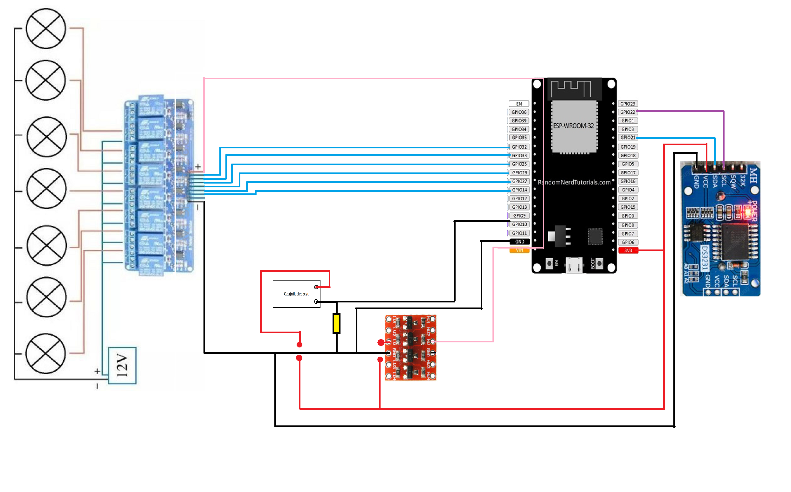

# **Autonomous Garden Irrigation System**

This project demonstrates a modular, automated system to manage multiple irrigation sections for a garden. Built using an ESP32 and Blynk, the system ensures efficient and timely water distribution based on user schedules and environmental inputs such as rain detection.

## **Overview**

The **Smart Garden Irrigation System** is designed to automate watering across multiple zones of a garden. It uses:
- **ESP32** for remote control and WiFi connectivity.
- Relays for controlling solenoid valves that regulate water flow to specific sections.
- Environmental sensors (rain sensor) to optimize water usage.

This system reduces water waste and simplifies irrigation management, making it ideal for smart gardening enthusiasts.

### System operation
* If rain is detected the system changes into not-operational state for 24h. After that time the system is again operational unless there is still water in rain sensor.
* Every valve opens at specified hour (local time) and closes after time set by the slider.
* Device time is synchronized from the network using NTP (WiFi/internet required). Firmware is configured for Warsaw timezone (CET/CEST).
* If time is not yet synchronized (e.g., no internet), automatic schedule starts are skipped (manual control still works).

## **Features**

- **Multi-Zone Irrigation:** Control multiple garden sections independently.
- **Scheduled Watering:** Uses NTP-synchronized local time for accurate irrigation timing.
- **Rain Detection:** Automatically suspend irrigation during rain.
- **WiFi Connectivity:** Remote monitoring and control via platforms like Blynk.
- **Scalability:** Add more zones or sensors as needed.

## **Hardware Requirements**

- **ESP32 Development Board**  
- **X-Channel Relay Module** (for controlling solenoid valves)  
- **Rain Sensor**  
- **Solenoid Valves** (one per irrigation zone)  
- 12V DC Power Supply  
- Wires, resistors, and connectors  

## **Schematics**

### 1. **ESP32 Multi-Zone Irrigation Control**
This schematic showcases the connections between the ESP32, relay module, and the rain sensor to control solenoid valves across multiple garden sections.

## **Software Setup**

### **Prerequisites**
Before starting, ensure you have the following libraries installed in your Arduino IDE:
- [Blynk Library](https://github.com/blynkkk/blynk-library) (for IoT connectivity)

Optional network check (from a computer on the same WiFi):
- `python3 utils/check_ntp_udp123.py` to verify outbound UDP/123 (NTP) is reachable.

### **Setting Up ESP32 in Arduino IDE**
To program the ESP32, you need to add the ESP32 board support to the Arduino IDE:

1. Open Arduino IDE.
2. Go to **File > Preferences**.
3. In the "Additional Boards Manager URLs" field, add the following [URL](https://raw.githubusercontent.com/espressif/arduino-esp32/gh-pages/package_esp32_index.json)
4. Go to **Tools > Board > Boards Manager**, search for "ESP32," and install the ESP32 platform.

### **Steps to Upload Code**
1. Open the provided `.ino` files in the Arduino IDE.  
2. Select the appropriate board (**ESP32**).  
3. Connect the board to your computer via USB.  
4. Upload the code to the respective devices.

## **Usage**

1. **Setup Hardware:**
- Assemble the circuit as per the schematics.
- Connect solenoid valves to the relay module to control irrigation zones.

2. **Power On the System:**
- Supply 12V power to the relays and valves.
- Ensure the ESP32 is powered and connected to WiFi.

3. **Schedule Irrigation:**
- Use the Blynk app or pre-configure the Arduino code to set watering schedules.

4. **Real-Time Monitoring:**
- Check for rain sensor status to avoid unnecessary watering.

## **Contributing**

Contributions are welcome! If you have ideas for new features or improvements, feel free to submit a pull request or open an issue.

## **License**

This project is licensed under the MIT License.

